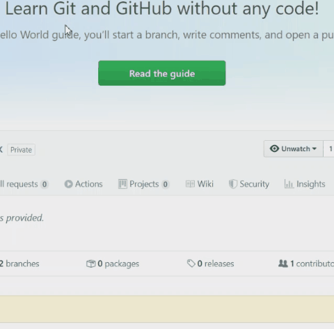

  
  
KOLAY SÖZLÜK

**Kolay Sözlük** [CefSharp](https://github.com/cefsharp/CefSharp/) ve [Html Agility Pack (HAP)](https://github.com/zzzprojects/html-agility-pack) kullanılarak yazılmış bir sözlüktür.

### Neye çare oluyor?
* İngilizce yazılar okurken sürekli kelime araştırma ihtiyacına,
* Kelimeleri liste yapmaya,
* Hem Türkçe hem İngilizce sözlüklere bakma gereksinimine,  

çare oluyor.

## Kullanım

* Her hangi bir programda kelimeyi seçin ve **CTRL+ALT+D** kısyoluna basın.
*  Aranan kelimenin sayfasına sağ tıklayıp “Sözlüğe Ekle” seçeneğine basarak kelimeyi listeye ekleyin.
* Listeleme butonuna basarak kaydettiğiniz kelimeleri listeleyin.

## Lisans
Bu proje MIT Lisansı kapsamında lisanslanmıştır. Ayrıntılar için [LICENSE.md](LICENSE.md) dosyasını inceleyin.

Logoda:
* <a href="http://www.freepik.com">Freepik</a>
* <a href="http://www.freepik.com">gstudioimagen / Freepik</a>

tasarımlarından yararlanılmıştır.